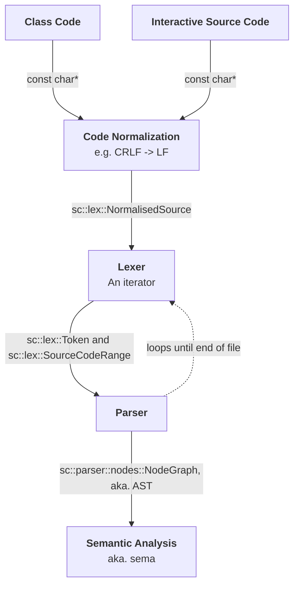

# Notes on compiler tool chain

## Simplified control flow

```mermaid
flowchart TB
    src["`
        **Interactive Source Code**
    `"]

    c["`
        **Class Code**
    `"]


    normalize["`
        **Code Normalization**
        e.g. CRLF -> LF
    `"]

    lexer["`    
        **Lexer**
        An iterator
    `"]

    parser["`**Parser**`"]

    sema["`
        **Semantic Analysis**
        aka. sema
    `"]

    c ---> |const char*|normalize;

    src 
    ---> |const char*|normalize 
    ---> |sc::lex::NormalisedSource|lexer
    ---> |sc::lex::Token and sc::lex::SourceCodeRange|parser
    ---> |sc::parser::nodes::NodeGraph, aka. AST|sema

    ;

    parser -. loops until end of file.-> lexer;

```

